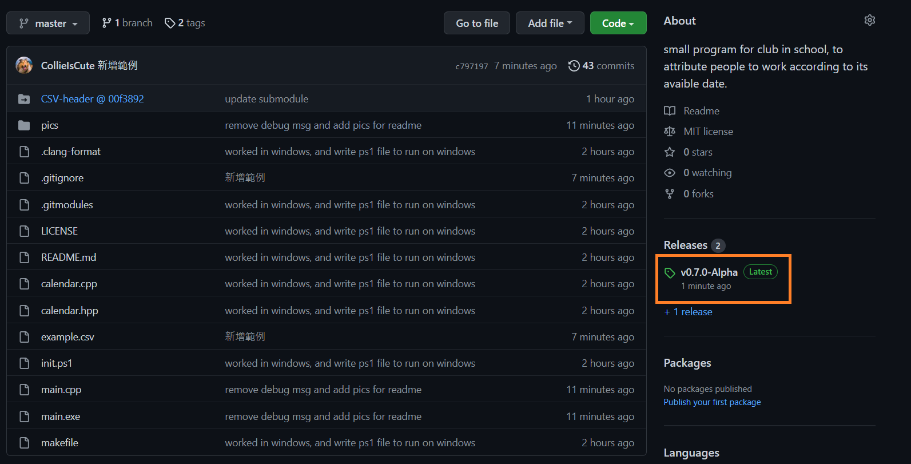

自動排值日生程式 meal-prep
===
鑒於每次排打飯值日生都會花不少時間，因此想寫個程式自動讀入表單回覆，並且排完值日生~  
# 使用教學
## 步驟 1
- 先到 google 表單回覆頁面，並且依照此方式下載並選擇 `csv` 檔案。存檔名稱可自訂，名稱 __不可包含空格__。因為待會要用到，建議取 __簡短英文名稱__ ，範例中我將檔案取名為 `input.csv`, 後面也以此代稱。
- 
- 
- 
## 步驟 2
- 到網頁右側，點擊圖示並且下載此二檔案。下載完後將 `init.ps1`、`main.exe`、`input.csv` 三個檔案放在自訂的任一資料夾。
- 
- 
- 
## 步驟 3
- 點選 `init.ps1` ，右鍵並點選 `用 PowerShell 執行`。這時有可能會跳出警告提示，按繼續即可。接著按照藍色視窗的提示，輸入所需要的欄位。 請注意，__每次表單回覆不一定會是同樣的欄位，順序有可能改變__。例如這次 `姓名` 與 `上山日期` 欄位分別是 `1`, `3`. 最後輸入表單回覆檔名(範例中名為`input.csv`)，待跳出 `檔案已建立` 字樣後即完成。
- 
- 
- 
## 步驟 4
- 最後會產生四種不同格式，但是內容同步的值日生分配表與參加人員統計，可利用 `記事本` 查看。 `work#.csv` 統計值日生排班， `attend#.csv` 統計參加活動全體人員。如下圖所示：
- 
- 
- 
- 
- 

# Troubleshooting
## 作業系統
此程式目前僅支援 windows8 以上版本，未來有可能會陸續支援其他作業系統。
## 其他問題
若遇到其他問題，或者想幫忙改進程式，可連絡[我的信箱](qetup1988@gmail.com) 、[發 PR 給我](https://gitbook.tw/chapters/github/pull-request)，或[發 issue 給我](https://github.com/CollieIsCute/meal-prep/issues)  